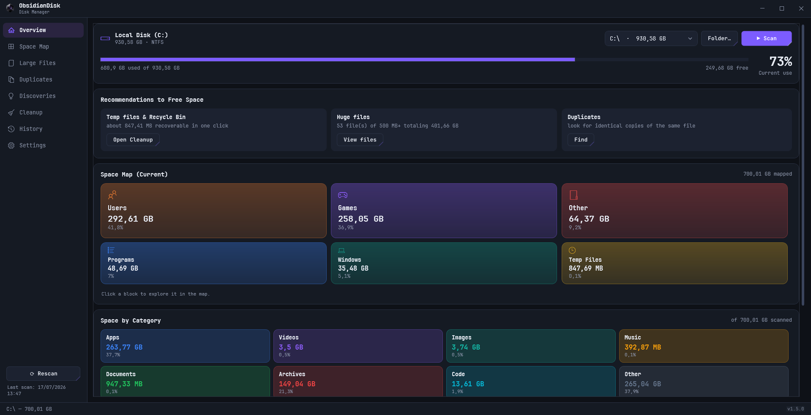

<div align="center">


# ObsidianDisk

**A modern visual disk space manager for Windows**

Find out what's eating your disk, explore it in a real-time interactive treemap,
learn what's safe to delete, hunt down huge files and duplicates, and free up
space — all in a single dependency-free app.

[](https://dotnet.microsoft.com/)
[](#)
[](LICENSE)
[](#)
[](../../releases/latest)



</div>

---

## 📥 Download

Grab the latest `ObsidianDisk.exe` from the [**Releases**](../../releases/latest) page and run it — **no installation, no .NET required**. It's a single self-contained executable for Windows 10/11 (x64).

> 💡 Tip: `ObsidianDisk.exe "C:\some\folder"` opens the app already scanning that path.

> ⚠️ Windows may warn about an "unknown publisher" — the app isn't code-signed yet. Click **More info → Run anyway**. The full source is here for you to inspect or build yourself.

---

## ✨ What it does

### 🏠 Overview
The landing dashboard. Shows a disk-usage bar with the used/free split and a big percentage, **semantic space blocks** that group your drive into human categories (Programs, Games, Windows, Users, Temp Files, Other), and a **per-file-type breakdown** (Apps, Videos, Images, Music, Documents, Archives, Code, Other). After a scan it also surfaces a **"Recommendations to free space"** card — how much you can reclaim from temp files and the Recycle Bin, how many huge (500 MB+) files exist, and a shortcut to the duplicate finder. First run greets you with a one-click **"Analyze my disk"** button.

### 🗺️ Space Map
A SpaceSniffer-style **squarified treemap** that builds **live while scanning** — the map fills in and refines itself as the disk is read, instead of making you wait. Folders are nested boxes, files are colored blocks sized by how much space they take.

- **List mode** — the same tree ranked with **length bars** instead of areas. Comparing rectangle areas is genuinely hard for the eye; length is far more accurate — and the list is natively readable by screen readers.
- **Navigation** — double-click drills into a folder, `Backspace` or the *Up* button goes back, and a **breadcrumb** (with folder/file icons and an overflow `…` for long paths) shows and jumps along the path.
- **Guided drill-down** — a *"Where did it go?"* button dives automatically into the largest folder, step by step, until it reaches the culprit eating your space.
- **Hover tooltip** — path, size, type, modified date, and a **safety verdict** (see below).
- **Filters** — show only one category (e.g. just videos), or dim everything modified in the last year so the old, forgotten files stand out.
- **Keyboard** — arrow keys move between blocks, `Enter` drills in, the Menu key opens actions.

### 🛡️ Safety advice
The treemap tells you *what is big*. ObsidianDisk also tells you **what you can safely delete**. Hover any known file or folder and it explains, in plain language, what it actually is and whether it can go:

- 🟢 **Safe to delete** · 🟡 **Be careful** · 🔴 **Don't delete**

It covers ~60 well-known Windows paths — `hiberfil.sys`, `pagefile.sys`, `WinSxS`, `Windows.old`, `Windows\Installer`, `System32`, `node_modules`, `.git`, Steam libraries, browser caches, and more — and points to the **right** way to remove them (e.g. *turn off hibernation* instead of deleting `hiberfil.sys`). Deleting a risky item always asks for confirmation and says why.

### 📄 Large Files
The biggest files on your disk in one list, filterable by minimum size (10 MB → 1 GB). Per-row checkboxes with select-all and a running "N checked · X GB" counter; delete the checked files to the Recycle Bin or permanently. The list fills in **during** the scan, not only at the end.

### 👯 Duplicates
Finds identical files with a fast 3-stage detector: group by size → compare a partial hash (256 KB) → confirm with a full SHA-256. Results are grouped and sorted by wasted space, with the **most recent copy left unchecked** (kept) so you review before deleting.

### 🔍 Discoveries
Four focused analyses over your last scan, all in one page:

- **Forgotten folders** — large folders you haven't modified in over a year, candidates to archive or remove.
- **Wasted extensions** — space grouped by usually-reclaimable file types (`.log`, `.tmp`, `.cache`, `.iso`, `.zip`…).
- **Dev artifacts** — build and dependency folders that tools regenerate: `node_modules`, `bin`, `obj`, `.venv`, `target`, `dist`, `__pycache__`…
- **Forgotten large files** — big files you haven't *opened* in over a year (uses last-access time).

Every result is actionable — open in Explorer, send to the Recycle Bin, or delete permanently, all with Undo.

### 🧹 Cleanup
One click to reclaim space from known junk locations — user Temp, Windows Temp, Windows Update cache, thumbnail cache, Windows error reports, and the Recycle Bin. Pick a **Conservative** or **Aggressive** profile to choose what gets cleaned in one move, or fine-tune the selection yourself. Sizes are measured up front, the button shows how much you'll free, and items in use are skipped safely. Includes a **"Restart as administrator"** button to reach protected system files.

### 📈 History
Every completed scan is saved. The History page draws an **evolution chart**, min/avg/max statistics, a growth trend, a **disk-full projection** ("at this rate the disk fills up around …"), and exports the whole history to CSV. A **"What changed"** card compares your two latest scans and highlights the folders that grew or shrank the most — topped by a plain-language **explanation of where your space went** (*"Since Jul 10, this disk grew 12 GB — most of it from Downloads"*).

### 🔔 Disk-full alert
ObsidianDisk warns you **before** the disk fills up: a native Windows notification when usage crosses a threshold (configurable — 80/85/90/95%, default 90%) or when the growth projection says the drive will fill up soon. It alerts once per session and re-arms when things go back to normal.

### 🗑️ Safe deletion & Undo
Delete to the **Recycle Bin** (reversible) or **permanently**, always with a clear confirmation. Sent something to the bin by mistake? The **Undo** button in the status bar restores it.

---

## 🎨 Personalization

- **🌙 Dark & Light themes** — *Obsidian* (dark) and *Quartz* (light), switchable **live** (no restart).
- **🌍 5 languages** — English, Português, Español, Français, Deutsch. Follows your Windows language automatically, or pick one in Settings.
- **♿ Accessibility** — keyboard navigation across the treemap, screen-reader support, and an optional **colorblind-safe palette** (Okabe-Ito).
- **🔔 Proactive & unobtrusive** — an optional **system-tray** icon (with a disk-usage tooltip), **minimize-to-tray**, and native notifications when the disk is filling up.
- **⌨️ Modern UI** — JetBrains Mono typography, a borderless window with a custom title bar, subtle animations that respect your Windows "reduced motion" setting, live update notifications, and a **software-rendering** toggle for GPU drivers that leave artifacts around text.

---

## 🔧 Build from source

Requirements: [.NET SDK 8.0+](https://dotnet.microsoft.com/download/dotnet/8.0) on Windows.

```powershell
git clone https://github.com/oPaozinh0/ObsidianDisk.git
cd ObsidianDisk
dotnet publish -c Release
# output: bin\Release\net8.0-windows\win-x64\publish\ObsidianDisk.exe
```

## 🏗️ Architecture

| Component | Role |
|---|---|
| `Services/DiskScanner` | Parallel scan with atomic size propagation (enables live rendering) |
| `Controls/TreemapControl` | *Squarified* layout + direct `OnRender` drawing, cached, keyboard-navigable, with an AutomationPeer for screen readers |
| `Controls/ObsidianButton` | Custom button drawn as vector geometry (immune to a WPF/GPU glyph artifact) |
| `Services/SafetyDatabase` | Plain-language verdict for ~60 known Windows paths |
| `Services/DuplicateFinder` | 3-stage duplicate detection with parallel hashing |
| `Services/DiscoveryAnalyzer` | The four Discoveries analyses over the in-memory tree |
| `Services/TempCleaner` | Measures and cleans known Windows temp locations |
| `Services/SemanticGrouper` | Classifies disk folders into semantic blocks |
| `Services/LiveWatcher` | Keeps the map in sync with the disk via `FileSystemWatcher` |
| `Services/SnapshotStore` | Lightweight per-scan tree snapshot (top folders) for diffs and trends |
| `Services/DiskForecaster` | Linear-regression growth projection shared by History and the alert |
| `Services/TrayService` · `Notifier` | System-tray icon and native notifications (dependency-free) |
| `Resources/Strings.*.xaml` | Localization for 5 languages · `Themes/*.xaml` — Dark/Light palettes |
| `Views/*` | Dashboard pages (WPF) |

## 🤝 Contributing

Issues and pull requests are welcome! Found a bug or have an idea? [Open an issue](../../issues).

## ☕ Support the project

If ObsidianDisk helped you reclaim a few gigabytes, consider supporting its development:

<a href="https://buymeacoffee.com/obsidiandisk" target="_blank">
  
</a>
&nbsp;
<a href="https://livepix.gg/opaozinh0" target="_blank">
  
</a>

> 🇧🇷 **LivePix** accepts Pix — the easiest option if you're in Brazil.

## 📄 License

Distributed under the [MIT](LICENSE) license.
